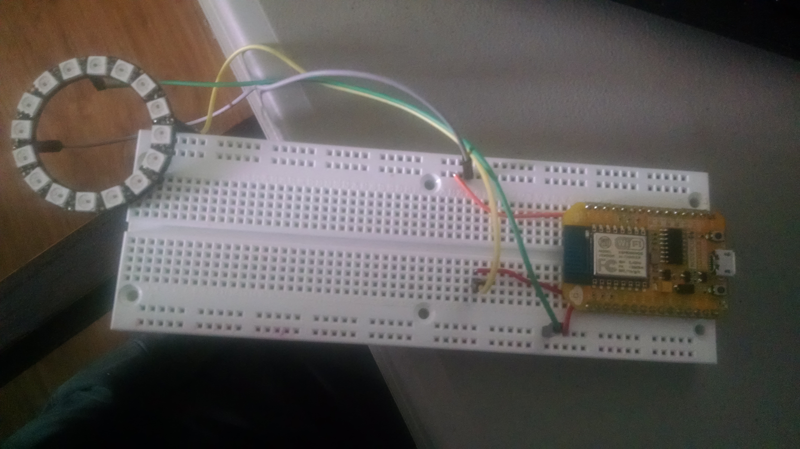

### NodeMCU (ESP8266) Pictures

Hook up Guide.
Note: The sketch is using pin 2, which is really pin D4 on the NODEMCU. 
on the MP3 player - D0 is connected to TX, and D1 to RX

What mine looks like on a breadboard.

